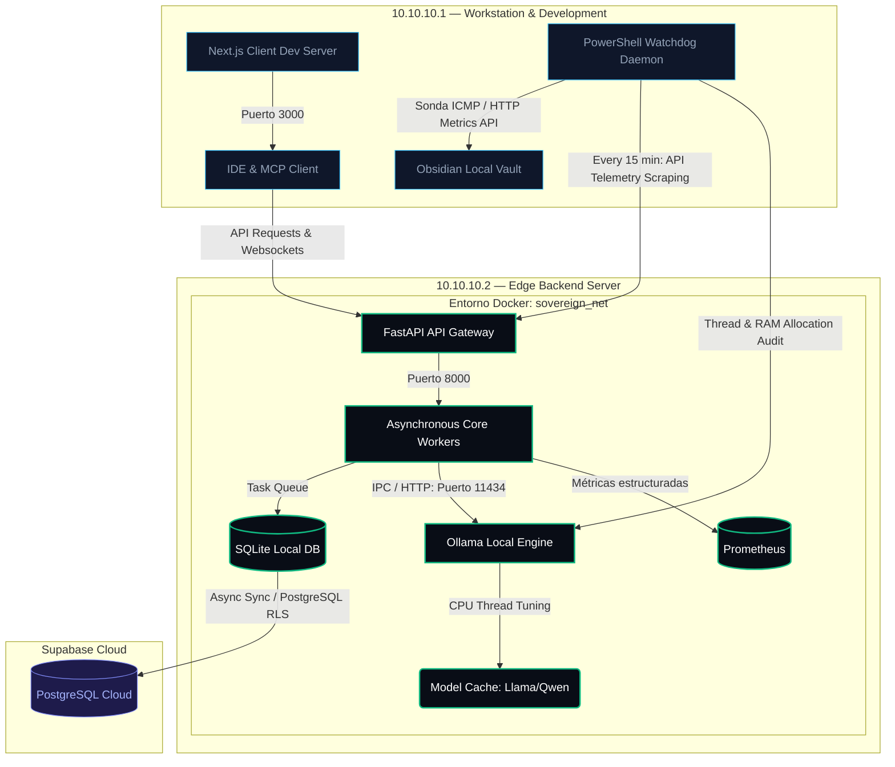
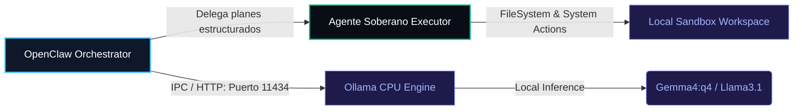

# AutomatizAI Engineering Handbook

Production-oriented operating system, architectural principles, and distributed infrastructure doctrine for resilient AI systems and workflow automation.

---

## 🏛️ 1. Engineering Doctrine

AutomatizAI systems are designed under the firm assumption that **operational simplicity is a feature, not a limitation**. Every architectural node and technological choice must operationalize a strict balance of cost, complexity, and systems resilience.

Every infrastructure component introduces:
- maintenance cost,
- cognitive overhead,
- operational risk,
- failure propagation potential,
- and long-term debugging complexity.

Because of this, infrastructure must actively justify its existence operationally. 

The default engineering posture of AutomatizAI is:
- **local-first** where feasible,
- **observable-by-default** from day one,
- **cost-aware** in every loop,
- **failure-tolerant** under extreme environments,
- and **maintainable by small teams** under constrained resources.

We explicitly prioritize deterministic operational behavior over premature distributed scalability. Constraints are treated as first-class architectural inputs rather than temporary inconveniences.

---

## 📂 2. Standard Project Structure

Every product and repository created at AutomatizAI must inherit this standardized directory structure to ensure maintainability and eliminate design drift:

```txt
├── .github/workflows/    # CI/CD pipelines (Security Scanning & Linting)
├── config/               # Telemetry and core configuration profiles
├── docs/
│   ├── adr/              # Architecture Decision Records (ADRs)
│   ├── images/           # Prometheus/Grafana dashboard screenshots & architecture charts
│   └── roadmap.md        # Technical milestones & optimization vectors
├── src/
│   ├── api/              # FastAPI routers, security middleware, and schema validation
│   ├── core/             # Mutex lock handling, DB sync, and cryptography
│   ├── pipeline/         # Orchestrator orchestration logic and agent rules
│   └── workers/          # Core task workers and local queue execution loops
├── tests/                # Integration, unit, and LLM evaluation tests
├── docker-compose.yml    # Sandboxed local edge network setup
└── README.md             # Product operational README
```

---

## ⚙️ 3. Systems Engineering Standards

To enforce a high standard of reliability, every codebase must implement our operational budgets, complexity constraints, and resilience patterns.

### A. Operational Budgets (Resource Constraints)
We design software strictly bounded by physical environment ceilings to preserve runway:
- **Execution Ceilings:** Services are constrained to operate optimally under **<= 4 vCPUs** and **<= 16GB RAM**.
- **Inference Prioritization:** Local inference (Ollama CPU-bound) is preferred for standard, low-priority tasks. Cloud inference is strictly reserved for high-confidence, high-priority transactions.
- **Infrastructure Sprawl:** Always-on cloud runtimes must be kept at a near-zero cost footprint.

### B. Complexity Budgets
We avoid premature enterprise abstractions. The following technologies are **explicitly banned** unless objective operational metrics demonstrate absolute necessity:
- No Kubernetes or complex container orchestration systems.
- No distributed consensus brokers (e.g., Consul, Etcd).
- No heavy event streaming infrastructure (e.g., Kafka).
- No unnecessary microservice splits (prefer monolithic modular architectures).
- No dedicated external vector database clusters (prefer local file-based vector libraries or PGVector).

### C. Observability Requirements
Every running system must expose structured instrumentation:
- **Health endpoint (`/health`):** Diagnostic status checks.
- **Structured Logs:** Task-correlated, JSON-serialized logging streams.
- **Latency metrics:** Track runtime execution deltas of critical pipelines.
- **Error counters:** Active tracking of exceptions and network degradation.
- **Queue metrics:** Active worker count, queue depth, and processing throughput.

### D. Escalation Philosophy
Our systems must fail gracefully using a hierarchical mitigation queue:
1.  **Local recovery:** The task worker attempts self-healing via engine resets or memory recycling.
2.  **Retry with backoff:** Queue processing retries using stateful exponential delay loops.
3.  **Graceful degradation:** The API degrades functionally, returning simplified or cached payloads rather than throwing unhandled exceptions.
4.  **Operator alert:** Human intervention is triggered only after all automated recovery steps are exhausted.
*Cascading, automatic retries across multiple third-party API providers are strictly forbidden to prevent sudden API bill escalation.*

---

## 🔌 4. Distributed Reference Architecture

Our physical network topology is designed as a localized edge computing LAN segment (`10.10.10.0/24`) optimized for isolation, data sovereignty, and robust gigabit data transfer.

### Physical Network Topology



### Operational Role Separation

#### ASUS TUF Workstation (`10.10.10.1`)
- **Responsibility:** IDE/development sandbox, local MCP client orchestration (e.g., Cursor, VS Code StdIO transports), telemetry collection, and human-readable Markdown database reports (Obsidian).
- **Operational Constraints:**
  - Not designed for persistent 24/7 background execution.
  - Client-side orchestration only.
  - No active ownership of transaction queues.

#### HP Edge Server (`10.10.10.2`)
- **Responsibility:** Sole queue owner, async task executor, local LLM inference host, network telemetry gateway, and metrics scraper.
- **Operational Constraints:**
  - Optimized for low-power, fanless 24/7 physical operation.
  - Local inference bounded strictly by CPU-cores and system memory limits.
  - Higher write-contention rates under extreme multi-client parallel spikes.

---

## 🤖 5. Agentic Architecture (OpenClaw + Agente Soberano)

Our workflow automation and local task execution layers are orchestrated via a dual-agent sovereign topology designed to operate efficiently under constrained local hardware.

### A. Agent Topologies



#### OpenClaw (Orchestrator)
- **Role:** High-level coordinator, planner, and task decomposition engine.
- **Operational Profile:** Bounded strictly to local CPU-bound inference (`Ollama` running `gemma4:q4` or lightweight Llama models). It executes task orchestration and schedules queues, enforcing a strict system keep-alive state.

#### Agente Soberano (Executor)
- **Role:** Sandboxed execution agent that translates structured JSON plans into system operations.
- **Operational Profile:** Direct file writes, SQLite queries, and interaction with the FastAPI Gateway. Operates under sandboxed permissions with absolute telemetry logging, providing full execution trace audits.

### B. Sovereign Business Pipeline
The standard transaction flow for customer ingestion and automated site operations follows a rigid deterministic flow:
1. **Lead Ingestion:** A new customer registers on `automatizai.cl`.
2. **Control Hub Queue:** Lead metadata is ingested into the local Control Hub's SQLite queue.
3. **OpenClaw Processing:** The Orchestrator picks up the task and evaluates it locally.
4. **Specialized Collaboration:** Coordinates actions (e.g. system setup, SEO or legal parameters checking).
5. **Sovereign Execution:** The Agente Soberano executes sandboxed filesystem configurations and database updates, committing the transaction.

---

## ⚠️ 6. Failure Modes Mapping

Our physical nodes and local services are mapped against defensive software-mitigation patterns:

| Failure Mode | Operational Impact | Technical Mitigation |
| :--- | :--- | :--- |
| **SQLite WAL Lock Contention** | Queue write latency spikes during parallel database updates. | Implement serialized write mutex locks in the core DB sync module. |
| **Ollama RAM Thrashing** | Local inference engine freezes during rapid LLM swaps on CPU. | Implement strict model keep-alive rules and thread allocation constraints via watchdog daemon. |
| **Network Starvation** | Cloud data sync cycles fail due to WAN network drops. | Implement stateful offline queuing in local SQLite, deferring Supabase synchronization until ping returns. |
| **Playwright Browser Leaks** | Web automation tasks consume excessive RAM on the HP Server. | Enforce strict browser process recycling rules and memory cleanup triggers in task workers. |

---

## ⚖️ 7. Architectural Tradeoffs

We accept conscious design trade-offs to protect maintainability and limit infrastructure sprawl:

| Architectural Choice | Benefits | Accepted Consequences & Costs |
| :--- | :--- | :--- |
| **Local SQLite Queue** | Offline resilience, low latency, local file-based database simplicity. | Increased write contention compared to Postgres under heavy write loads. |
| **Local Inference (Ollama)** | Zero-cost inference bills, absolute data privacy, edge independence. | Lower token throughput (tokens/second) compared to cloud GPU runtimes. |
| **Monolithic Modular Backend** | Rapid codebase changes, zero service boundary network latency, low mental overhead. | Reduced horizontal scaling granularity across distinct functional modules. |
| **Docker Compose isolation** | Standardized containerization, fast environment recovery, zero cloud-provider lock-in. | Manual container orchestrations required (no automated Kubernetes scheduler). |

---

## 🛑 8. Explicit Non-Goals

We maintain discipline by explicitly excluding standard cloud-native concepts from our scope:
- **No Kubernetes orchestration:** We rely on single-node Docker Compose simplicity.
- **No distributed inference clusters:** We do not scale models across multiple network-linked GPUs.
- **No high-frequency GPU scheduling:** We optimize CPU thread allocations for low-power hardware.
- **No globally distributed queues:** All task sequencing is local-first.
- **No heavy event streaming infrastructure:** We rely on lightweight local files and DB queues.
- **No multi-region active-active replication:** Sincronización asíncrona a un único nodo de base de datos en nube.

---

## 📊 9. Operational Economics

AutomatizAI infrastructure is built with high financial discipline:
- **Low Idle Power Draw:** Edge hardware optimized for minimal physical power consumption.
- **Zero Cloud Sprawl:** We deploy to the cloud only when required for external client interfaces, reducing running cloud bills to near-zero.
- **Local Priority:** Ingesting, parsing, and scoring leads locally before executing external commercial APIs.
- **Single-Operator Maintenance:** Engineered to run with zero dedicated DevOps or System Administrator teams.

---

## 📄 10. Architecture Decision Ledger (ADRs)

We require every structural change to be written as an Architecture Decision Record (ADR) under `/docs/adr/`. Each ADR must contain our strict **5-Block Structure**:

1.  **Context:** The physical network parameters, resource limits, and business constraints.
2.  **Decision:** The chosen technical solution and architectural parameters.
3.  **Tradeoffs:** Conscious tradeoffs accepted (Pros and Cons).
4.  **Consequences:** Operational impacts on the codebase, testing, and system maintenance.
5.  **Rejected Alternatives:** Discarded solutions and the exact technical reasons why.

---

## 🔄 11. Product Creation & Production Review

### Lifecycle Step-by-Step
1.  **Fijar Límites en README:** Initialize the repository by documenting *Non-Goals*, *Known Constraints*, *Failure Modes*, and *Operational Budgets*.
2.  **Redactar ADRs:** Document stack and infrastructure decisions using the 5-block model.
3.  **Desarrollo Incremental:** Track code development using Conventional Commits.
4.  **Operational Review:** Prove system health under the production checklist.

### Operational Production Checklist
Before launching any product to production, the service must approve this checklist:
-   [ ] **Failure Modes:** Are all task-specific failure modes identified and mapped?
-   [ ] **Metrics Exposed:** Does the service expose `/health` status and Prometheus telemetry hooks?
-   [ ] **Retry Policy:** Are task workers running stateful backoff loops?
-   [ ] **Cost Impact:** Have inference cost projections been estimated and capped?
-   [ ] **Recovery Path:** Has manual worker crash and environment recovery been tested successfully?
-   [ ] **Logs Structured:** Are logs emitted as JSON objects containing unique task trace IDs?

