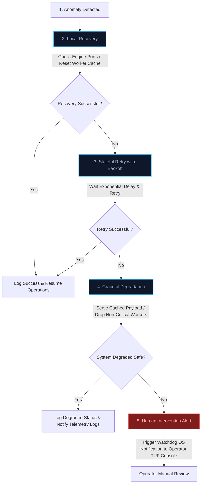

# AutomatizAI Operations Playbook

Internal, SRE-lite runbooks, recovery procedures, and escalation matrices for edge systems operations.

---

## 🛑 1. SQLite WAL Contention & Corruption Recovery

### Issue Indicator
- Log messages showing `DatabaseIsLockedException` or `sqlite3.OperationalError: database is locked`.
- Queue task latency spikes beyond normal bounds.

### Diagnostic Command
Check active write lock holders or database process activity from the HP Server CLI:
```bash
fuser -v src/core/database.db
```

### Recovery Procedure
If database lock contention occurs under parallel write spikes:

1. **Enable WAL Mode and Serialized Writes (Safeguard Reset):**
   Open the database console and force WAL journal configurations:
   ```bash
   sqlite3 src/core/database.db
   ```
   Execute these PRAGMA statements:
   ```sql
   PRAGMA journal_mode=delete;
   PRAGMA journal_mode=wal;
   PRAGMA synchronous=NORMAL;
   PRAGMA busy_timeout=5000;
   .quit
   ```

2. **Database Vacuuming (File Size Cleanup):**
   If page corruption is suspected or database fragmentation is high:
   ```bash
   sqlite3 src/core/database.db "VACUUM;"
   ```

3. **Re-activate Mutex Queues:**
   Restart the worker task loops to clear memory thread states:
   ```bash
   docker-compose restart core-workers
   ```

---

## 🤖 2. Ollama CPU Engine Thrashing Recovery

### Issue Indicator
- CPU thread usage spikes to 100% on the HP Server without completing inference tasks.
- API requests fail with `InferenceTimeoutException` or Ollama container does not respond on port `11434`.

### Diagnostic Command
Audit active Ollama container resource usage and loaded model weights:
```bash
docker stats ollama-container
docker exec -it ollama-container ollama list
```

### Recovery Procedure
If CPU thread locks or model thrashing occurs due to heavy concurrent loaded states:

1. **Hotswap Model Eviction (Clear RAM):**
   Force-unload the loaded model weights by calling the Ollama API directly:
   ```bash
   curl http://localhost:11434/api/generate -d '{"model": "llama3.2", "keep_alive": 0}'
   ```

2. **Force-Restart the Inference Engine Container:**
   If Ollama is non-responsive:
   ```bash
   docker-compose restart ollama-container
   ```

3. **Verify Thread Constraint Allocation:**
   Ensure CPU hilos limitations are loaded in your `docker-compose.yml` to prevent Ollama from exhausting the HP Server host resources:
   ```yaml
   services:
     ollama:
       deploy:
         resources:
           limits:
             cpus: '3.0' # Restrict to 3 cores on a 4-vCPU host
   ```

---

## 🌐 3. Playwright Session Leak Recycling

### Issue Indicator
- High RAM consumption on the HP Server that does not decline after automation tasks finish.
- Playwright logs showing `Target Closed` or `Navigation Timeout` errors.

### Diagnostic Command
Check for orphaned chromium or browser processes on the host:
```bash
ps aux | grep -iE 'chromium|node|playwright'
```

### Recovery Procedure
If browser memory leaks are starving the edge system resources:

1. **Kill Orphaned Browser Processes:**
   Execute process termination commands to release leaked virtual RAM:
   ```bash
   killall -9 chrome chromium chrome-sandbox 2>/dev/null || true
   ```

2. **Enable Worker Recycling Policy:**
   Ensure your Python core worker file has a strict maximum-execution recycling cap. Force the worker process to exit and restart after executing `50` scraping runs to trigger host garbage collections:
   ```python
   # Inside src/workers/scraper_worker.py
   if run_count >= 50:
       logger.info("Recycling scraper worker to prevent memory drift.")
       sys.exit(0) # Let Docker Compose restart the container cleanly
   ```

3. **Verify Playwright Browser Context Isolation:**
   Check that every scraping block runs inside a strict `try/finally` context wrapper that forces context closures:
   ```python
   # Code standard review
   context = await browser.new_context()
   try:
       # scraping run...
   finally:
       await context.close()
   ```

---

## 📊 4. Watchdog Telemetry Health Restoration

### Issue Indicator
- No updates appearing in the Obsidian Vault local files on the ASUS TUF (`10.10.10.1`) workstation.
- Sonda ping latencies show missing reports.

### Diagnostic Command
Run diagnostics on the ASUS TUF Windows environment to verify scheduled task status:
```powershell
Get-ScheduledTask -TaskName "AutomatizAI_Watchdog" | Get-ScheduledTaskInfo
```

### Recovery Procedure
If the telemetry scheduler halts:

1. **Verify Network Connectivity (Gigabit LAN check):**
   From the ASUS TUF, ping the HP Server API Metrics endpoint:
   ```powershell
   Test-NetConnection -ComputerName 10.10.10.2 -Port 8000
   ```

2. **Manually Trigger Watchdog Script (Dry Run):**
   Execute the daemon directly from PowerShell Core to check for script syntax or path sync exceptions:
   ```powershell
   & "C:\Users\ASUS\.gemini\antigravity\scratch\ALPA_HUB\self-healing-daemon.ps1"
   ```

3. **Re-register ASUS Telemetry Task:**
   If the scheduler is corrupted, run the setup script to re-register the task:
   ```powershell
   & "C:\Users\ASUS\.gemini\antigravity\scratch\ALPA_HUB\setup-daemon.ps1"
   ```

---

## 📈 5. Incident Escalation Matrix

When an anomaly is detected, operations must escalate strictly following this hierarchical matrix:


