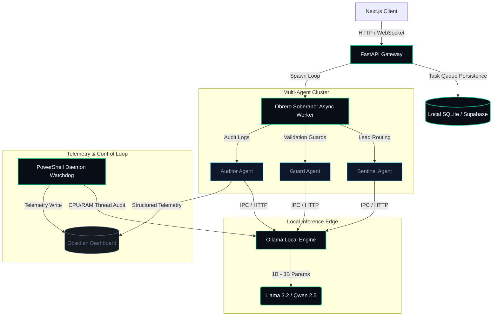

# AutomatizAI Hub

Production-oriented LLM orchestration platform focused on resilient automation, multi-provider failover, and defensive local AI pipelines.

---

## 🏗️ System Architecture

The following diagram illustrates the edge-centric, self-healing architecture of the AutomatizAI Hub:



---

## ⚡ Technical Features

- **Multi-Provider LLM Orchestration:** Seamless dynamic failover between remote state-of-the-art cloud providers and localized offline models.
- **Resilient Data Pipeline:** Hybrid storage pattern combining lightweight local SQLite queue processing with long-term PostgreSQL (Supabase) data warehousing and row-level security (RLS).
- **Hardened Criptographic Security:** Secure credential storage encrypted with AES-256-GCM in-memory prior to database save. Transaction webhooks verified through HMAC SHA-256 signatures to avoid replay attacks.
- **Defensive API Shielding:** Strict OWASP Top 10 mitigation including recursive input sanitization in FastAPI endpoints and dynamic Content Security Policies (CSP) header injection.
- **Self-Healing PowerShell Watchdog:** Telemetric OS-level scheduler auditing memory footprints, thread count allocation, and Ollama core RAM state every 15 minutes, auto-reporting to a local markdown database.

---

## 🛠️ Tech Stack

- **Applied AI:** Ollama (Llama 3.2, Qwen 2.5), LangChain, Custom Agent Engines (Sentinel, Guard, Auditor).
- **Backend & Automation:** Python 3.11 (FastAPI, asyncio, Uvicorn), PowerShell Core, Playwright.
- **Frontend & Interfaces:** Next.js 14 (App Router, Edge Middleware), React 19, TypeScript, Tailwind CSS.
- **Databases & Telemetry:** PostgreSQL (Supabase), SQLite, Redis, Prometheus.
- **DevOps:** Docker, Docker Compose, GitHub Actions (CI/CD), perimetral isolated networks (`sovereign_net`).

---

## 📂 Project Structure

```txt
├── .github/workflows/    # CI/CD pipelines (Security Scanning & Linting)
├── config/               # Telemetry and core configuration profiles
├── docs/
│   ├── adr/              # Architecture Decision Records (ADRs)
│   └── roadmap.md        # Technical milestones & optimization vectors
├── src/
│   ├── agents/           # Multi-agent specialized logic (Sentinel, Guard, Auditor)
│   ├── api/              # FastAPI routers, middleware, and schema validation
│   ├── core/             # Cryptography modules, database connectors, and worker core
│   └── workers/          # Obrero Soberano asynchronous loop queue
├── tests/                # Integration, unit, and LLM evaluation tests
├── docker-compose.yml    # Sandboxed local edge network setup
└── README.md
```

---

## 📄 Architectural Decisions (ADRs)

Our team documents all major technical trade-offs and structural changes using Architecture Decision Records (ADRs). You can explore them in depth:

*   **[ADR-0001: Local Inference Engine Selection](docs/adr/0001-local-inference-engine-selection.md)** - Selection of Ollama on CPU/RAM constraints versus remote Cloud APIs.
*   **[ADR-0002: Resilient Hybrid Database Strategy](docs/adr/0002-resilient-hybrid-database-strategy.md)** - Trade-offs of running localized SQLite write-mutex locks syncing with remote PostgreSQL.

---

## 🚀 Quick Start (Local Docker Edge)

To launch the isolated sandboxed environment local edge network running Ollama and FastAPI:

1. Clone the repository:
   ```bash
   git clone https://github.com/ppalominos/automatizai-hub.git
   cd automatizai-hub
   ```

2. Setup your local environment file:
   ```bash
   cp .env.example .env
   ```

3. Spin up the containers within the isolated network:
   ```bash
   docker-compose up --build -d
   ```

4. Verify local model status:
   ```bash
   docker exec -it ollama-container ollama list
   ```
