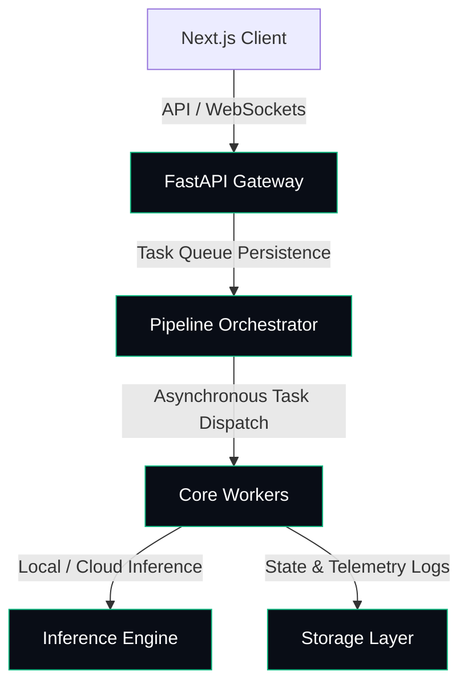

# AutomatizAI Hub

Production-oriented LLM orchestration platform focused on resilient automation, multi-provider failover, and defensive local AI pipelines.

---

## 🏗️ System Architecture

The following diagram illustrates the streamlined data flow and execution pipeline of the AutomatizAI Hub:



---

## 🎯 Design Principles

- **Offline-first where possible:** Host critical inference models locally to avoid external API dependencies and guarantee data sovereignty.
- **Fail gracefully:** Implement circuit breakers and fallback rules to route tasks during provider degradation.
- **Avoid vendor lock-in:** Keep core business logic abstracted from specific LLM vendors through standardized integration boundaries.
- **Small-team operability:** Design self-healing pipelines that require minimal operations overhead.
- **Observable by default:** Instrument all execution loops with Prometheus metrics and structured logging.
- **Defensive AI integration:** Implement strict guardrails to sanitize input streams and mitigate prompt injection risks.
- **Economic & Resource Efficiency:** Focus strictly on minimizing inference cost, reducing operational overhead, avoiding infrastructure sprawl, and preserving offline execution capability.

---

## ⚙️ Technical Features

- **Multi-Provider LLM Orchestration:** Seamless dynamic failover between remote state-of-the-art cloud APIs and optimized localized offline engines (Ollama, CPU thread tuning, keep-alive RAM allocations).
- **Resilient Queue Processing:** Asynchronous task queue running localized SQLite workers backed by transactions with automatic lock-contention mitigation.
- **Hardened Cryptographic Security:** Sensitive credentials encrypted using **AES-256-GCM** in-memory before database persistence. Payment webhooks validated using **HMAC SHA-256** signatures to mitigate replay vulnerabilities.
- **Defensive API Shielding:** OWASP Top 10 mitigation including recursive input sanitization in FastAPI endpoints and Content Security Policy (CSP) headers in SSR Next.js interfaces.
- **Self-Healing OS watchdogs:** Lightweight PowerShell daemons auditing memory footprints, CPU thread counts, and core engine availability, auto-logging anomalies to local markdown repositories.

---

## 🛑 Non-Goals

- **Building generalized autonomous AGI agents:** The platform does not attempt to solve generalized, open-ended autonomous cognitive planning. It is dedicated strictly to deterministic, structured workflow execution.
- **Replacing production-grade distributed schedulers:** We do not aim to replace large-scale enterprise message brokers (e.g., Celery, Temporal) for high-scale, distributed microservices; this queue is optimized specifically for edge compute constraints and local file-based simplicity.
- **Fine-tuning proprietary foundation models:** We optimize prompt engineering, context routing, and local hardware execution boundaries, rather than training or fine-tuning foundation architectures.
- **Creating high-frequency distributed inference clusters:** We do not focus on real-time, microsecond-level clustered inference distribution across massive GPU fleets.
- **Supporting unbounded horizontal scaling:** We prioritize localized resource containment and predictable edge deployments over elastic, cloud-native auto-scaling.

---

## ⚠️ Known Constraints

- **Hardware Limits:** Local inference throughput is constrained by consumer-grade CPU/GPU memory bandwidth.
- **Write Contention:** SQLite WAL contention increases under heavy concurrent queue saturation.
- **Tracing Limitations:** Cross-worker distributed tracing propagation is currently partial.
- **Execution Strategy:** Local-first execution prioritizes resilience and data privacy over maximum raw throughput.

---

## 🛠️ Operational Constraints

The platform is intentionally designed around:
- **Small-team maintainability:** Zero-overhead deployments requiring no dedicated operations teams.
- **Intermittent connectivity environments:** Resilient queuing patterns that handle unstable networks and offline runtimes seamlessly.
- **Low-cost inference routing:** Intentionally routing non-complex tasks to local models to preserve financial runway and avoid cloud fees.
- **Local-first execution where feasible:** Retaining transactional telemetry and computation perimeters offline.
- **Graceful degradation over hard failure:** Prioritizing gradual recovery loops and safe fallback modes over hard service crashes.
- **Operational simplicity over infrastructure complexity:** Eliminating complex cloud cluster routing in favor of robust, local sandboxed containers.

---

## 📂 Project Structure

```txt
├── .github/workflows/    # CI/CD pipelines (Security Scanning & Linting)
├── config/               # System and telemetry configurations
├── docs/
│   ├── adr/              # Architecture Decision Records (ADRs)
│   ├── images/           # Prometheus/Grafana dashboard screenshots & architecture charts
│   └── roadmap.md        # Technical milestones & optimization vectors
├── src/
│   ├── api/              # FastAPI routers, security middleware, and schema validation
│   ├── core/             # Mutex lock handling, DB sync, and cryptography
│   ├── pipeline/         # Orchestrator orchestration logic and agent rules
│   └── workers/          # Core task workers and local queue execution loops
├── tests/                # Integration, unit, and LLM evaluation tests
├── docker-compose.yml    # Sandboxed local edge network setup
└── README.md
```

---

## 📊 Telemetry & Visual Metrics

To verify system health, query the Prometheus dashboard at `http://localhost:9090`. For visual telemetry, review the operational screenshots located under `/docs/images/`:

*   **[Core Worker Queue Depth](docs/images/)** - Displays queue throughput, worker availability, and processing latency under concurrent loads.
*   **[Inference Resource Allocation](docs/images/)** - Real-time CPU thread utilization and memory consumption during Ollama model swaps.

---

## 📄 Architectural Decisions (ADRs)

We document every critical technical trade-off and system structure change using Architecture Decision Records (ADRs) located in `docs/adr/`:

*   **[ADR-0001: Local Inference Engine Selection](docs/adr/0001-local-inference-engine-selection.md)** - Selecting local CPU-bound Ollama instances over proprietary cloud LLMs.
*   **[ADR-0002: Resilient Hybrid Database Strategy](docs/adr/0002-resilient-hybrid-database-strategy.md)** - Selection of transactional SQLite queue handling synced asynchronously with remote PostgreSQL.

---

## 🚀 Project Status

*   **Current Stage:** *Active architecture and operational hardening.*
*   **Active Iteration Focus:**
    - Edge queue resilience under network starvation.
    - Automated CI/CD evaluation pipelines (hallucination checks & security scans).
    - Scraping concurrency optimizations and local cache invalidation.

---

## 📦 Quick Start (Local Docker Edge)

1. Setup environment parameters:
   ```bash
   cp .env.example .env
   ```

2. Spin up containers in the sandboxed local network:
   ```bash
   docker-compose up --build -d
   ```

3. Audit local core engine state:
   ```bash
   docker exec -it ollama-container ollama list
   ```
