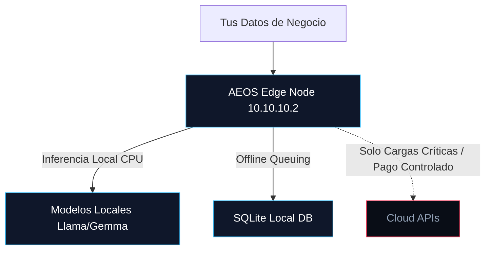
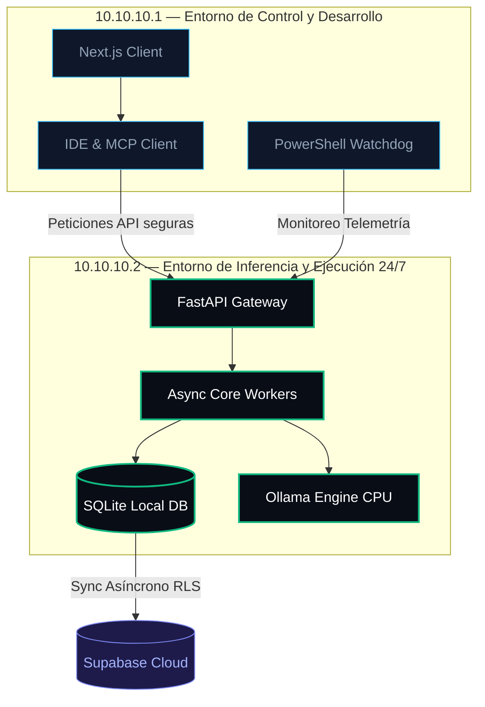

# AutomatizAI AEOS · B2B Pitch Deck
*Sovereign Edge AI Infrastructure & Resilient Workflow Automation Engine*

---

## 🖥️ Diapositiva 1: Portada (The Hook)
### Soberanía de Datos y Automatización AI con Costo Operativo Cero

```txt
┌────────────────────────────────────────────────────────┐
│                    AUTOMATIZAI AEOS                    │
│          SOVEREIGN EDGE OPERATING SYSTEM (v1.0)        │
│                                                        │
│     Infraestructura de IA local-first y automatización  │
│     de flujos con resiliencia de grado de producción.  │
│                                                        │
│               [ 10.10.10.0/24 Edge Node ]              │
└────────────────────────────────────────────────────────┘
```

> [!NOTE]
> **El Mensaje Clave:**
> Presentamos **AEOS (AutomatizAI Edge Operating System)**: la arquitectura distribuida local-first que permite a las empresas ejecutar flujos automatizados de IA sin depender de APIs de nube costosas, garantizando el 100% de la privacidad de sus datos y un coste operativo cercano a cero.

---

## 🚨 Diapositiva 2: El Problema (The Pain)
### La Crisis de la IA en la Nube: Facturas Imprevistas, Dependencia y Fugas de Datos

*   **API Bill Shock (Costes Desbocados):** Las llamadas masivas a modelos comerciales (OpenAI, Anthropic) representan costes exponenciales difíciles de predecir. Un bucle infinito en un agente puede consumir miles de dólares en minutos.
*   **Dependencia de Terceros (Vendor Lock-in):** Caídas de servicio en la API externa paralizan por completo la operación de negocio del cliente.
*   **Falta de Soberanía y Cumplimiento:** Sectores altamente regulados (legal, tributario, médico, banca) no pueden transferir datos sensibles de clientes a servidores externos bajo estrictas regulaciones de privacidad.
*   **Complejidad y Desperdicio (Over-engineering):** Equipos intentando resolver la automatización escalando infraestructuras cloud masivas (Kubernetes, Kafka) que consumen tiempo y presupuesto.

---

## 🏛️ Diapositiva 3: La Solución (The Value Proposition)
### AEOS: Simplicidad Operativa e Inferencia Local-First



*   **Coste Fijo y Predecible:** Inferencia local (Ollama CPU-bound) para tareas rutinarias y de volumen. La nube es un recurso controlado de último recurso.
*   **Privacidad Absoluta:** Procesamiento en el hardware físico de la empresa (Edge Node) o nubes privadas locales (Hetzner). Ningún dato sale sin autorización.
*   **Presupuesto de Recursos Estricto:** Diseñado bajo restricciones estrictas de hardware (**≤ 4 vCPUs y ≤ 16GB RAM**) para operar en equipos económicos sin degradar rendimiento.
*   **Resiliencia Autogestionada:** Sistemas tolerantes a caídas de red WAN gracias a colas persistentes locales.

---

## ⚙️ Diapositiva 4: La Arquitectura de 3 Niveles (AEOS Framework)
### Documentación y Operación Diseñada al Estándar de Staff Engineering

```txt
┌────────────────────────────────────────────────────────┐
│                     3-TIER AEOS                        │
├────────────────────────────────────────────────────────┤
│  NIVEL 1: HANDBOOK (Doctrina de Diseño)                │
│  - Simplicidad operativa, presupuestos de recursos.    │
├────────────────────────────────────────────────────────┤
│  NIVEL 2: OPERATIONS PLAYBOOK (SRE-Lite Manual)        │
│  - Procedimientos de auto-sanación ante fallos.        │
├────────────────────────────────────────────────────────┤
│  NIVEL 3: ADR LEDGER (Registro Técnico)                 │
│  - Historial de toma de decisiones de arquitectura.    │
└────────────────────────────────────────────────────────┘
```

> [!TIP]
> **La señal de ingeniería:**
> No entregamos código "mágico" o cajas negras. Entregamos un **sistema operativo documental e infraestructural** transparente. Cada decisión de diseño, límite de hardware o política de recuperación está explícitamente parametrizada y documentada para auditorías técnicas rápidas.

---

## 🔌 Diapositiva 5: Topología Física Distribuida (LAN Topology)
### Segmentación Física para Alta Disponibilidad y Desarrollo Seguro



*   **Aislamiento Operacional:** El desarrollo y la monitorización se realizan en la Workstation (`10.10.10.1`). La base de datos, las colas y los workers de ejecución corren 24/7 de forma fanless en el Edge Server (`10.10.10.2`).
*   **Sincronización Híbrida Asíncrona:** Datos críticos y de UI se sincronizan a la nube con seguridad RLS de Postgres de forma diferida, garantizando resiliencia ante caídas de internet.

---

## 🤖 Diapositiva 6: Arquitectura de Doble Agente (Orchestration)
### División de Roles: Planificación CPU-Bound y Ejecución Sandboxed

```txt
               ┌─────────────────────────────┐
               │    OpenClaw Orchestrator    │
               │   (Ollama CPU - Gemma4:q4)  │
               └──────────────┬──────────────┘
                              │
                    Delega plan de tareas
                              ▼
               ┌─────────────────────────────┐
               │       Agente Soberano       │
               │     (Executor Sandboxed)    │
               └──────────────┬──────────────┘
                              │
                    Ejecuta en el sistema
                              ▼
               ┌─────────────────────────────┐
               │     Core FileSystem / DB    │
               └─────────────────────────────┘
```

*   **OpenClaw (El Cerebro):** Ejecuta sobre modelos locales optimizados para CPU. Procesa instrucciones, descompone tareas complejas y genera planes estructurados en JSON.
*   **Agente Soberano (La Mano):** Un worker seguro en Python que ejecuta el plan del orquestador en un entorno local aislado (Sandbox). Realiza lecturas/escrituras en disco, llamadas API locales y modificaciones de base de datos con trazas de auditoría completas.

---

## ⚠️ Diapositiva 7: Mitigación SRE-Lite (Failure Modes)
### Diseño Defensivo contra Caídas de Sistemas Comunes

| Fallo Común de Sistema | Impacto Operativo | Mitigación Automatizada AEOS |
| :--- | :--- | :--- |
| **SQLite WAL Lock Contention** | Bloqueo por escrituras paralelas en cola. | Mutex locks serializados en el core `core/db_sync`. |
| **Ollama RAM Thrashing** | Congelación al alternar modelos locales en CPU. | Reglas de `keep_alive` y balanceo estricto de hilos del Watchdog. |
| **Network Starvation** | Fallo en sincronizaciones por caída de internet. | Cola local offline diferida hasta testeo de ping exitoso. |
| **Playwright Browser Leaks** | Consumo excesivo de RAM en automatización web. | Reciclado estricto de procesos browser por límite de transacciones. |

---

## 📊 Diapositiva 8: Economía Operativa (Operational Economics)
### Por Qué AEOS es Financieramente Superior a las Soluciones Tradicionales

```txt
┌────────────────────────────────────────────────────────┐
│                   COMPARATIVA ANUAL                    │
├────────────────────────────────────────────────────────┤
│  SOLUCIÓN TRADICIONAL CLOUD                            │
│  - Suscripciones API OpenAI: $400/mes                  │
│  - Servidores AWS EC2 (24/7): $150/mes                 │
│  - Total Anual: $6,600 USD (Costo Variable)            │
├────────────────────────────────────────────────────────┤
│  AUTOMATIZAI AEOS                                      │
│  - setup de hardware local: $800                       │
│  - APIs comerciales (backup): $20/mes                  │
│  - Total Anual (Año 1): $1,040 USD                     │
│  - Ahorro Proyectado: > 80% desde el Año 1             │
└────────────────────────────────────────────────────────┘
```

*   **Costo de Inferencia Cero:** Llama y Gemma locales procesan millones de tokens anuales a coste de consumo eléctrico ($0).
*   **Infraestructura Ligera:** No requiere personal DevOps dedicado. Las tareas de mantenimiento son automatizadas por el Watchdog local.
*   **Precios Predecibles:** Presupuesto corporativo blindado contra cambios unilaterales de precios de proveedores externos de IA.

---

## 💰 Diapositiva 9: Modelos Comerciales (Pricing & Deployment)
### Tres Formas de Adquirir AEOS según la Madurez de la Empresa

#### 1. AEOS DIY Blueprint (SaaS / Template)
*   *Para desarrolladores y equipos internos.* Acceso al repositorio Git parametrizado, manuales de arquitectura y plantillas de Docker Compose.
*   **Precio:** **$299 USD** (Licencia única de por vida).

#### 2. AEOS DWY Implementation (Servicio Consultoría)
*   *Para medianas empresas.* Ajustamos el sistema a sus necesidades, integramos sus flujos de negocio en el FastAPI Gateway y configuramos sus servidores de desarrollo (`10.10.10.1`) y producción (`10.10.10.2`).
*   **Precio:** **$3,500 USD** (Pago de setup único) + **$300/mes** (Servicio de soporte y auditoría SRE).

#### 3. AEOS Sovereign Appliance (Hardware + Software)
*   *Para industrias de alta privacidad.* Entregamos un mini-computador físico fanless de grado industrial preconfigurado con el sistema operativo AEOS, listo para conectar al switch de la oficina.
*   **Precio:** **$5,500 USD** (Hardware de alto rendimiento incluido).

---

## 🚀 Diapositiva 10: Live Demo e Invitación a la Acción
### Observa la Resiliencia de AEOS en Tiempo Real

```txt
       [ ABRIR DEMO: preview_handbook.html ]
       
   Simula caídas de red, observa la consola SRE,
   ejecuta comandos en tiempo real y experimenta 
   la solidez de un sistema diseñado para no parar.
```

> [!IMPORTANT]
> **Próximos Pasos para Iniciar:**
> 1.  **Evaluación de Infraestructura:** Auditamos tu hardware actual y diseñamos tu presupuesto de complejidad.
> 2.  **Despliegue de Sandbox:** Montamos el entorno Docker Compose en menos de 48 horas.
> 3.  **Aislamiento y Soberanía:** Migramos tus flujos y blindamos tus datos corporativos de la nube pública.
